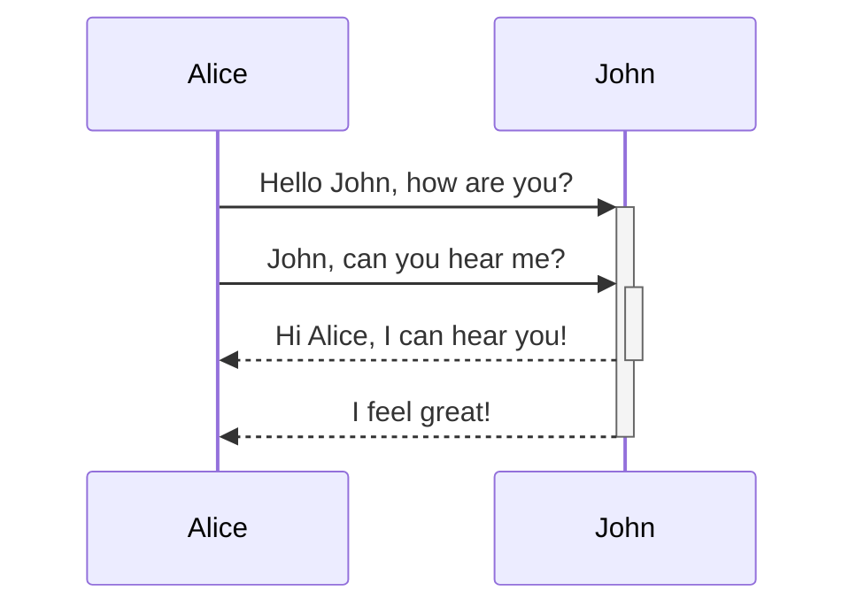
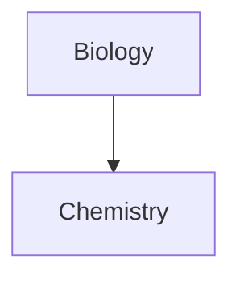

Learn how to apply basic formatting to your Obsidian notes, using [Markdown](https://daringfireball.net/projects/markdown/). Import this as a note into your Obsidian Vault to view it and to test new themes. Certain community plugins are required for a few features.
- - -
# Basic Formatting Syntax
- - - 
## Paragraphs

To create paragraphs, use a blank line to separate one or more lines of text.

```
This is a paragraph.

This is another paragraph.
```

Multiple blank spaces

Multiple adjacent blank spaces in and between paragraphs collapse to a single space when displaying a note in [Reading view](https://help.obsidian.md/Editing+and+formatting/Editing+and+previewing+Markdown#Editor%20views) and on [Obsidian Publish](https://help.obsidian.md/Obsidian+Publish/Introduction+to+Obsidian+Publish) sites.

```md
Multiple          adjacent          spaces


and multiple newlines between paragraphs.
```

> Multiple          adjacent          spaces
>
>
>
> and multiple newlines between paragraphs.

If you want to add multiple spaces, you can add `&nbsp;` (blank space) and `<br>` (newline) to your note.

```md
Multiple&nbsp;&nbsp;&nbsp;&nbsp;&nbsp;&nbsp;&nbsp;&nbsp;&nbsp;&nbsp;&nbsp;adjacent&nbsp;&nbsp;&nbsp;&nbsp;&nbsp;&nbsp;&nbsp;&nbsp;&nbsp;&nbsp;&nbsp;spaces
<br>
<br>
<br>
and multiple newlines between paragraphs.
```

>Multiple&nbsp;&nbsp;&nbsp;&nbsp;&nbsp;&nbsp;&nbsp;&nbsp;&nbsp;&nbsp;&nbsp;adjacent&nbsp;&nbsp;&nbsp;&nbsp;&nbsp;&nbsp;&nbsp;&nbsp;&nbsp;&nbsp;&nbsp;spaces
> <br>
> <br>
> <br>
> and multiple newlines between paragraphs.

## Headings

To create a heading, add up to six `#` symbols before your heading text. The number of `#` symbols determines the size of the heading.

```md
# This is a heading 1
## This is a heading 2
### This is a heading 3
#### This is a heading 4
##### This is a heading 5
###### This is a heading 6
```

# This is a heading 1

## This is a heading 2

### This is a heading 3

#### This is a heading 4

##### This is a heading 5

###### This is a heading 6

## Styling text

| Style                  | Syntax                   | Example                        | Output                      |
|------------------------|--------------------------|--------------------------------|-----------------------------|
| Bold                   | `** **` or `__ __`       | `**Bold text**`                | **Bold text**               |
| Italic                 | `* *` or `_ _`           | `*Italic text*`                | _Italic text_               |
| Strikethrough          | `~~ ~~`                  | `~~Striked out text~~`         | ~~Striked out text~~        |
| Highlight              | `== ==`                  | `==Highlighted text==`         | ==Highlighted text==        |
| Bold and nested italic | `** **` and `_ _`        | `**Bold text and _nested italic_ text**` | **Bold text and _nested italic_ text** |
| Bold and italic        | `*** ***` or `___ ___`   | `***Bold and italic text***`   | ***Bold and italic text***  |

## Quotes

You can quote text by adding a `>` symbols before the text.

```md
> Human beings face ever more complex and urgent problems, and their effectiveness in dealing with these problems is a matter that is critical to the stability and continued progress of society.

\- Doug Engelbart, 1961
```

> Human beings face ever more complex and urgent problems, and their effectiveness in dealing with these problems is a matter that is critical to the stability and continued progress of society.

- Doug Engelbart, 1961

>[!info]
 You can turn your quote into a [callout](https://help.obsidian.md/Editing+and+formatting/Callouts) by adding `[!info]` as the first line in a quote.

## Code

You can format code both inline within a sentence, or in its own block.

### Inline code

You can format code within a sentence using single backticks.

```md
Text inside `backticks` on a line will be formatted like code.
```

Text inside `backticks` on a line will be formatted like code.

If you want to put backticks in an inline code block, surround it with double backticks like so: inline ``code with a backtick ` inside``.

### Code blocks

To format a block of code, surround the code with triple backticks.

````
```
cd ~/Desktop
```
````

```md
cd ~/Desktop
```

You can also create a code block by indenting the text using `Tab` or 4 blank spaces.

```md
    cd ~/Desktop
```

You can add syntax highlighting to a code block, by adding a language code after the first set of backticks.

````md
```js
function fancyAlert(arg) {
  if(arg) {
    $.facebox({div:'#foo'})
  }
}
```
````

```js
function fancyAlert(arg) {
  if(arg) {
    $.facebox({div:'#foo'})
  }
}
```

Obsidian uses Prism for syntax highlighting. For more information, refer to [Supported languages](https://prismjs.com/#supported-languages).

Note

[Live Preview mode](https://help.obsidian.md/Live+preview+update) doesn't support PrismJS and may render syntax highlighting differently.

## External links

If you want to link to an external URL, you can create an inline link by surrounding the link text in brackets (`[ ]`), and then the URL in parentheses (`( )`).

```md
[Obsidian Help](https://help.obsidian.md)
```

[Obsidian Help](https://help.obsidian.md/)

>[!tip]
 If you want to link to a file inside your vault, consider using an [internal link](https://help.obsidian.md/Linking+notes+and+files/Internal+links) instead.

You can also create external links to files in other vaults, by linking to an [Obsidian URI](https://help.obsidian.md/Concepts/Obsidian+URI).

```md
[Note](obsidian://open?vault=MainVault&file=Note.md)
```

### Escape blank spaces in links

If your URL contains blank spaces, you need to escape them by replacing them with `%20`.

```md
[My Note](obsidian://open?vault=MainVault&file=My%20Note.md)
```

You can also escape the URL by wrapping it with angled brackets (`< >`).

```md
[My Note](<obsidian://open?vault=MainVault&file=My Note.md>)
```

## External images

You can add images with external URLs, by adding a `!` symbol before an [external link](https://help.obsidian.md/Editing+and+formatting/Basic+formatting+syntax#External%20links).

```md

```


You can change the image dimensions, by adding `|120x160` to the link destination, where 120 is the width and 160 is the height.

```md

```


If you only specify the width, the image scales according to its original aspect ratio by adding `|75]]` to the link destination, which scales the image to 70% of the original aspect ratio.

```md
![[Engelbart.jpg|75]](https://history-computer.com/ModernComputer/Basis/images/Engelbart.jpg)
```


>[!tip]
 If you want to add an image from inside your vault, you can also [embed an image in a note](https://help.obsidian.md/Linking+notes+and+files/Embedding+files#Embed%20an%20image%20in%20a%20note).

## Lists

You can create an unordered list by adding a `-`, `*`, or `+` before the text.

```md
- First list item
* Second list item
+ Third list item
```

- First list item
* Second list items 
+ Third list item

To create an ordered list, start each line with a number followed by a `.` symbol.

```md
1. First list item
2. Second list item
3. Third list item
```

1. First list item
2. Second list item
3. Third list item

You can create a nested list by indenting one or more list items.

```md
1. First list item
   1. Ordered nested list item
2. Second list item
   - Unordered nested list item
```

1. First list item
    1. Ordered nested list item
2. Second list item
    - Unordered nested list item

You can press `Tab` or `Shift+Tab` to indent or unindent one or more selected list items.

### Task lists

To create a task list, start each list item with a hyphen and space followed by `[ ]`.

```md
- [x] This is a completed task.
- [ ] This is an incomplete task.
```

- [x] This is a completed task.
- [ ] This is an incomplete task.

You can toggle a task in Reading view by selecting the checkbox.

>[!tip]
 You can use any character inside the brackets to mark it as complete.

```md
- [x] Milk
- [?] Eggs
- [-] Eggs
- [>] Eggs
```

- [x] Milk
- [?] Eggs
- [-] Eggs
- [>] Eggs

## Horizontal bar

You can use three or more stars `***`, hyphens `---`, or underscore `___` on its own line to add a horizontal bar. You can also separate symbols using spaces.

```md
***
****
* * *
---
----
- - -
___
____
_ _ _
```

- - -

## Footnotes

You can add footnotes[^1] to your notes using the following syntax: [^note]

```md
This is a simple footnote[^1].

[^1]: This is the referenced text.
[^2]: Add 2 spaces at the start of each new line.
  This lets you write footnotes that span multiple lines.
[^note]: Named footnotes still appear as numbers, but can make it easier to identify and link references.
```

[^1]: This is a footnote.
[^note]:  This is a named footnote.
  Written over multiple lines.

You can also inline footnotes in a sentence. Note that the caret goes outside the brackets. ^[This is an inline footnote]

```md
You can also use inline footnotes. ^[This is an inline footnote.]
```

> [!note]
 Inline footnotes only work in Reading View, not in Live Preview.

## Comments

You can add comments by wrapping text with `%%`. Comments are only visible in Editing view.

```md
This is an %%inline%% comment.

%%
This is a block comment.

Block comments can span multiple lines.
%%
```

___
_ _ _
# Advanced Formatting Syntax
- - -

## Tables

You can create table using vertical bars (`|`) and hyphens (`-`). Vertical bars separate columns, and hyphens define the column header.

```md
| First name | Last name |
| ---------- | --------- |
| Max        | Planck    |
| Marie      | Curie     |
```

|First name|Last name|
|---|---|
|Max|Planck|
|Marie|Curie|

The vertical bars or either side of the table are optional.

Cells don't need to be perfectly aligned with the columns. Each header row must have at least two hyphens.

```md
First name | Last name
-- | --
Max | Planck
Marie | Curie
```

### Format content within a table

You can use [basic formatting syntax](https://help.obsidian.md/Editing+and+formatting/Basic+formatting+syntax) to style content within a table.

|First column|Second column|
|---|---|
|[Internal links](https://help.obsidian.md/Linking+notes+and+files/Internal+links)|Link to a file _within_ your **vault**.|
|[Embedding files](https://help.obsidian.md/Linking+notes+and+files/Embedding+files)||

Vertical bars in tables

If you want to use [aliases](https://help.obsidian.md/Linking+notes+and+files/Aliases), or to [resize an image](https://help.obsidian.md/Editing+and+formatting/Basic+formatting+syntax#External%20images) in your table, you need to add a `\` before the vertical bar.

```md
| First column | Second column |
| -- | -- |
|[[Markdown Formatting Guide#Basic Formatting Syntax\|Markdown Basics]]||
```

|First column|Second column|
|---|---|
|[[Markdown Formatting Guide#Basic Formatting Syntax\|Markdown Basics]]||

You can align text to the left, right, or center of a column by adding colons (`:`) to the header row.

```md
Left-aligned text | Center-aligned text | Right-aligned text
:-- | :--: | --:
Content | Content | Content
```

|Left-aligned text|Center-aligned text|Right-aligned text|
|:--|:-:|--:|
|Content|Content|Content|

## Diagram

You can add diagrams and charts to your notes, using [Mermaid](https://mermaid-js.github.io/). Mermaid supports a range of diagrams, such as [flow charts](https://mermaid.js.org/syntax/flowchart.html), [sequence diagrams](https://mermaid.js.org/syntax/sequenceDiagram.html), and [timelines](https://mermaid.js.org/syntax/timeline.html).

>[!tip]
You can also try Mermaid's [Live Editor](https://mermaid-js.github.io/mermaid-live-editor) to help you build diagrams before you include them in your notes.

To add a Mermaid diagram, create a `mermaid` [code block](https://help.obsidian.md/Editing+and+formatting/Basic+formatting+syntax#Code%20blocks).

````md

````


````md

````


### Linking files in a diagram

You can create [internal links](https://help.obsidian.md/Linking+notes+and+files/Internal+links) in your diagrams by attaching the `internal-link` [class](https://mermaid.js.org/syntax/flowchart.html#classes) to your nodes.

````md

````


>[!note]
> 
 Internal links from diagrams don't show up in the [Graph view](https://help.obsidian.md/Plugins/Graph+view).
>
 If you have many nodes in your diagrams, you can use the following snippet.
>
> ````md
> ```mermaid
> graph TD
> 
> A[Biology]
>B[Chemistry]
>
 A --> B
>
 class A,B,C,D,E,F,G,H,I,J,K,L,M,N,O,P,Q,R,S,T,U,V,W,X,Y,Z internal-link;
> ```
> ````


This way, each letter node becomes an internal link, with the [node text](https://mermaid.js.org/syntax/flowchart.html#a-node-with-text) as the link text.

> [!note]
> If you use special characters in your note names, you need to put the note name in double quotes.
> ```
> class "⨳ special character" internal-link
> ```
>
> Or, `A["⨳ special character"]`. 

For more information about creating diagrams, refer to the [official Mermaid docs](https://mermaid.js.org/intro/).

## Math

You can add math expressions to your notes using [MathJax](http://docs.mathjax.org/en/latest/basic/mathjax.html) and the LaTeX notation.

To add a MathJax expression to your note, surround it with double dollar signs (`$$`).

```md
$$
\begin{vmatrix}a & b\\
c & d
\end{vmatrix}=ad-bc
$$
```

$$
\begin{vmatrix}a & b\\
c & d
\end{vmatrix}=ad-bc
$$

You can also inline math expressions by wrapping it in `$` symbols.

```md
This is an inline math expression: $e^{2i\pi} = 1$.
```

This is an inline math expression: $e^{2i\pi} = 1$.

For more information about the syntax, refer to [MathJax basic tutorial and quick reference](https://math.meta.stackexchange.com/questions/5020/mathjax-basic-tutorial-and-quick-reference).

For a list of supported MathJax packages, refer to [The TeX/LaTeX Extension List](http://docs.mathjax.org/en/latest/input/tex/extensions/index.html).

## Links

This Guide was derived using:
- [Basic formatting syntax](https://help.obsidian.md/Editing+and+formatting/Basic+formatting+syntax)
- [Advanced formatting syntax](https://help.obsidian.md/Editing+and+formatting/Advanced+formatting+syntax)
- [Obsidian Flavored Markdown](https://help.obsidian.md/Editing+and+formatting/Obsidian+Flavored+Markdown)

- - -
- - -
