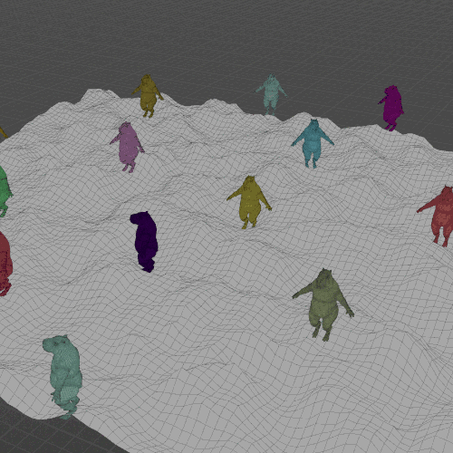
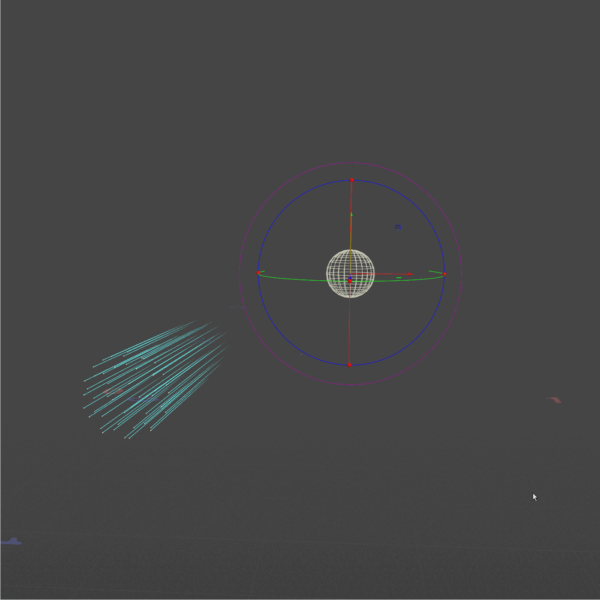
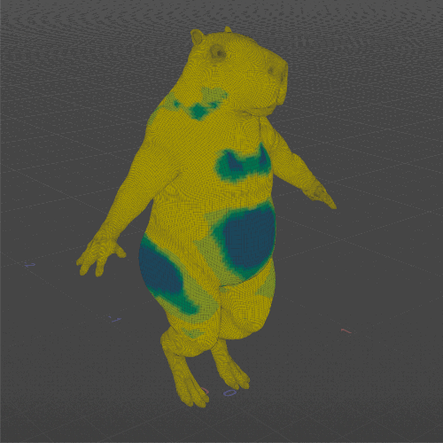
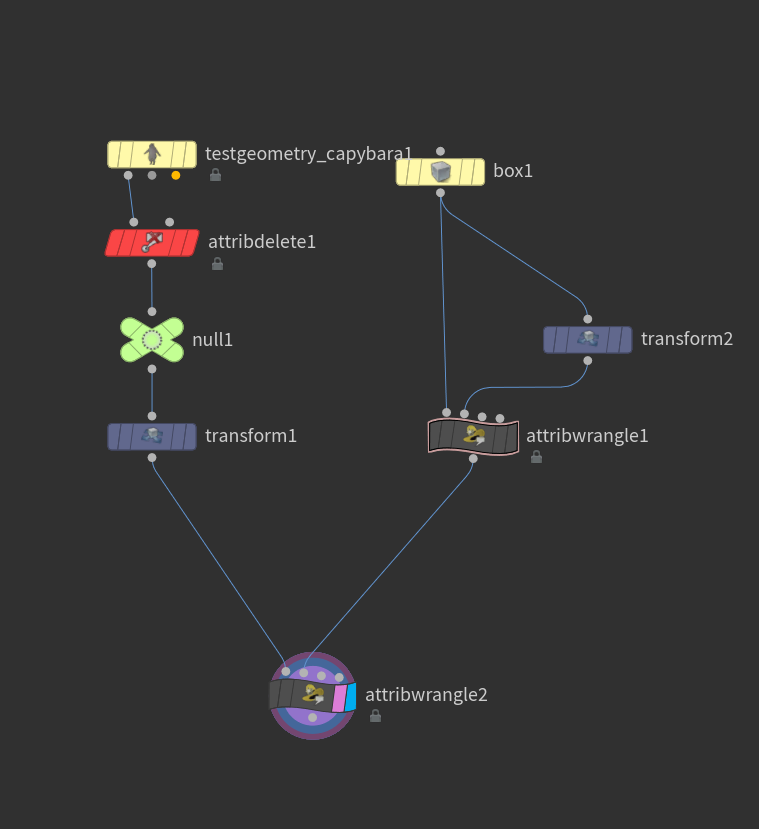
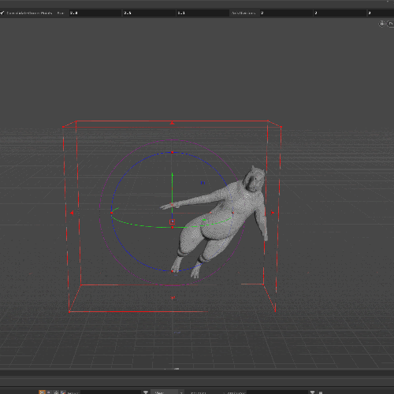
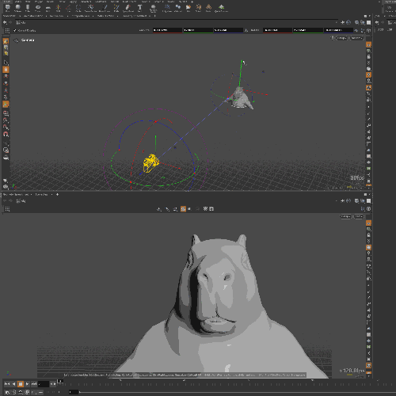
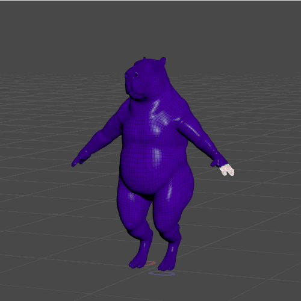
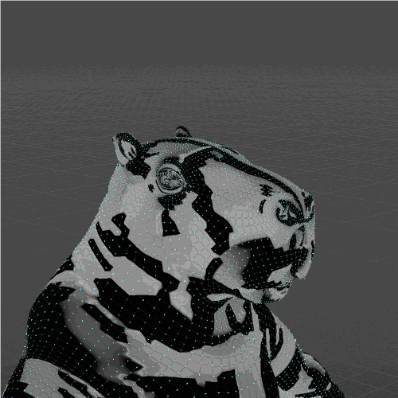

## My humble list of usefull VEX snippets


Ok, let's start with a classic xyz-primuv combo

```
// Get data from surface
xyzdist(1, @P, prim, uv);

// Set scattered point position
@P = primuv(2, "P", prim, uv);
```

[](IMG/xyz1.gif)


Another simple VEX lookat function

```
// points are looking to the second input 
// run over points 
@N = normalize(point(1, 'P', 0) - @P); @up = {0, 1, 0};
```

[](IMG/Lookat1.gif)

Pcopen is one of the most powerfull approach for VFX inside VEX. This is a simple density measure snippet.

```
int pointCloud = pcopen(0, 'P', @P, ch('radius'), chi('max_points'));
int pcNumFound = pcnumfound(pointCloud);
f@density = fit(pcNumFound, 0, chi('max_points'), 0, 1);
```

[](IMG/Density1.gif)

Custom bend with pcopen. In some cases might be helpfull

```
//first wrangle

vector deformed = point(1,"P",@ptnum);
v@delta = deformed - @P;

```

```
//second wrangle

int handle = pcopen(1, "P", @P, 5, 500);
vector delta = pcfilter(handle, "delta");
@P = @P + delta; 

```
[](IMG/bend1.png)

[](IMG/bend2.gif)


Frustum by camera

```
v@NDC = toNDC(chs("cam"),v@P);
float nearclip = chf("clip");
float padding = chf("padding");

if(v@nNDC.x > (1 + padding) || v@NDC.x < (0 - padding) || v@NDC.y > (1 + padding) || v@NDC.y < (0 - padding) || -v@NDC.z < nearclip){
removepoint(0,@ptnum);
}

```
[](IMG/frustum1.gif)

There are so many ways to infect in houdini. This one is with arrays. Get start group assigning "infect=1" attribute. Put wrangle in solver.

```
if (@infect==1){ append(i[]@infList,@ptnum); }


int nNum; if (@infect==1){
int handle = pcopen(0,"P",@P,ch("radius"),chi("Pts")); 

while (pciterate(handle)){ 
pcimport(handle,"point.number",nNum); 
append(i[]@infList,nNum); 
setpointattrib(0,"infect",nNum,1,"set");

}
}

```
[](IMG/infect1.gif)

There are different scenarios in VFX. So that is why "Normals towards nearest neighboors".

```
int handle = pcopen(0, 'P', @P, ch('radius'), 2);

vector closeP;

while(pciterate(handle)){

pcimport(handle, "P", closeP);

@N = closeP - @P;
}
```
[](IMG/normal.gif)

